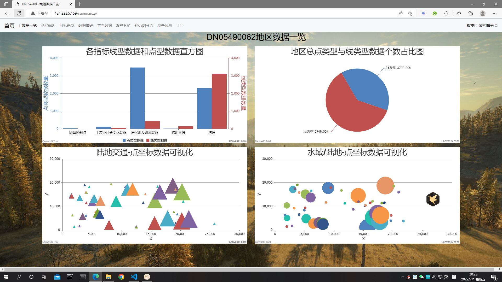
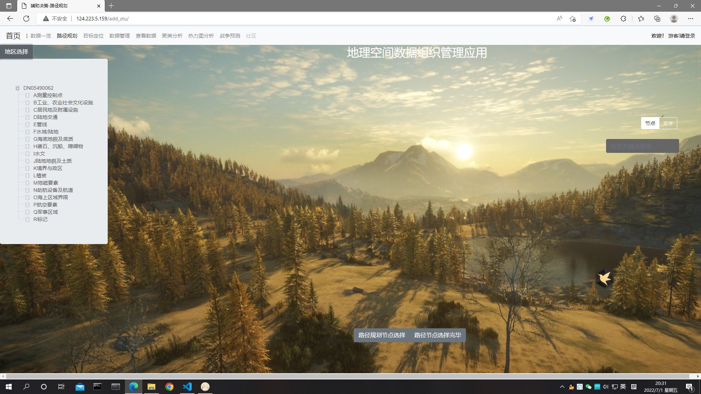
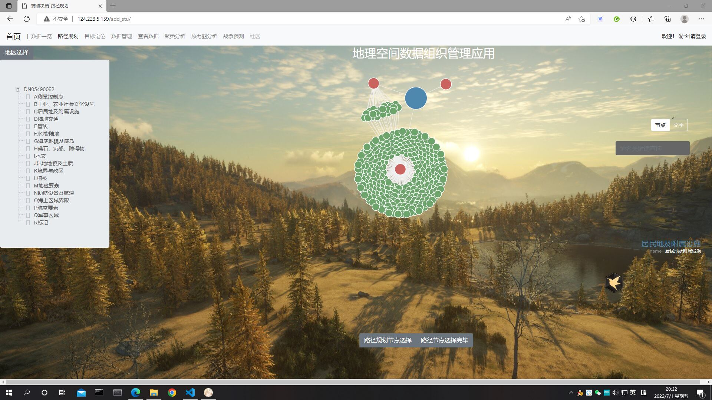
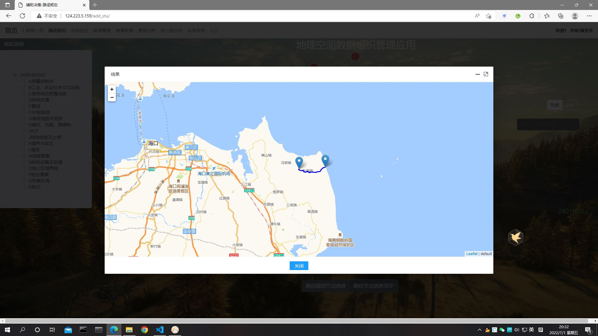

# 地理数据可视化系统和战地环境辅助决策项目

## 地理数据可视化系统介绍
1. 首页展示了地理点的知识图谱的可视化联通图。如下图所示，可以在右侧的框框中检索需要的点或者种类。

2. “数据一览”标签页展示了该地区的可视化图表。主要是散点图和饼状图。如图所示：

3. “路径规划”标签页
    * “路径规划”标签页如图所示：

    * 在点开了“地区选择”并选择了相应的坐标类型后会显示与首页相似的知识图谱，如下所示：

    * 先点击“路径规划节点选择”，再依次选择起点和终点，最后点击“路径节点选择完毕”便可进行路劲规划，路径规划示例如下所示：

4. 
